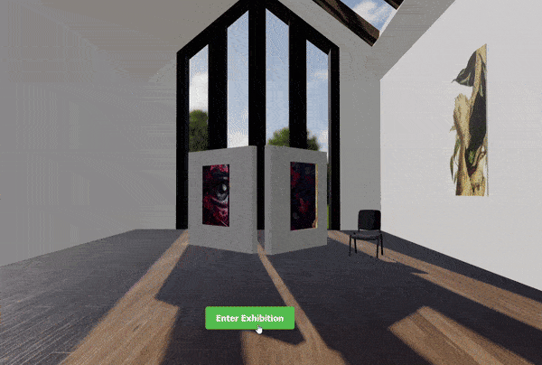

# gallery — Virtual Exhibition

A browser-based 3D art gallery built with React Three Fiber. Navigate through a realistic virtual room with 11 framed paintings, reflective floors, dynamic spotlights, and generative ambient audio.



---

## Quick start

**Live demo:** [https://gallery-imran.vercel.app](https://gallery-imran.vercel.app)

Clone from your preferred remote:

```bash
# GitHub
git clone https://github.com/imranshiundu/gallery.git

# Gitea (Kood)
git clone https://gitea.kood.tech/imranshiundu/gallery.git
```

```bash
cd gallery
npm install

# dev server (http://localhost:5173)
npm run dev

# production build
npm run build

# preview production build
npm run preview
```

Requires **Node 18+**.

---

## How it works

1. **Loading screen** — real-time progress bar as the GLB model and 11 painting textures load
2. **Entry screen** — dual-row artwork marquee with shimmering title; click "Enter Exhibition" to begin
3. **Gallery navigation** — 12 camera waypoints (overview + 11 painting views); use arrow keys, on-screen arrows, or swipe on mobile
4. **Info panel** — shows painting title, artist, and description for the current view
5. **Audio toggle** — generative ambient audio (no mp3 files; built with WebAudio)

---

## Tech stack

| Layer | Library | Version |
|-------|---------|---------|
| UI | React | 18.2 |
| 3D | Three.js | 0.160 |
| 3D React | @react-three/fiber | 8.15 |
| 3D helpers | @react-three/drei | 9.92 |
| Animation | @react-spring/three | 9.7 |
| Bundler | Vite | 5.0 |

---

## Room specifications

```
Width:   12 m  (±6.0 from center)
Depth:    8 m  (±4.0 from center)
Height:  3.5 m
```

Walls are positioned at x = ±5.94 and z = ±3.94. Floor at y = 0. Ceiling at y = 3.5.

---

## Camera system

12 waypoints connected by cubic ease-in-out transitions. Each waypoint defines a position, look-at target, and field of view.

| # | Label | Position | Look-at | FOV | Dist. | Yaw | Pitch |
|---|-------|----------|---------|-----|-------|-----|-------|
| 0 | Overview | (3.6, 2.4, 2.9) | (-1, 1.3, -1.2) | 55° | 6.26m | -138° | -10° |
| 1 | W1 — Ethereal Horizons | (-2.6, 1.62, 0.35) | (-5.9, 1.6, 0) | 40° | 3.32m | -174° | 0° |
| 2 | W2 — Whispers in Amber | (-2.6, 1.66, 2.5) | (-5.9, 1.62, 2.5) | 42° | 3.30m | 180° | -1° |
| 3 | W3 — Monumental Forms | (-2.6, 1.62, -2.5) | (-5.9, 1.58, -2.5) | 42° | 3.30m | 180° | -1° |
| 4 | N1 — Urban Fragments | (-3, 1.66, 1.1) | (-3, 1.6, 3.9) | 40° | 2.80m | 90° | -1° |
| 5 | N2 — Still Life with Flowers | (0, 1.62, 1.0) | (0, 1.56, 3.9) | 40° | 2.90m | 90° | -1° |
| 6 | N3 — Composition in Blue | (3, 1.66, 1.1) | (3, 1.6, 3.9) | 40° | 2.80m | 90° | -1° |
| 7 | E1 — Serenity | (2.6, 1.66, -0.35) | (5.9, 1.6, 0) | 42° | 3.32m | 6° | -1° |
| 8 | E2 — Tidal Memory | (2.6, 1.62, -2.5) | (5.9, 1.56, -2.5) | 40° | 3.30m | 0° | -1° |
| 9 | S1 — Digital Garden | (-3, 1.62, -1.1) | (-3, 1.56, -3.9) | 40° | 2.80m | -90° | -1° |
| 10 | S2 — Balance | (0, 1.66, -1.05) | (0, 1.6, -3.9) | 40° | 2.85m | -90° | -1° |
| 11 | S3 — Nocturne | (3, 1.62, -1.1) | (3, 1.56, -3.9) | 40° | 2.80m | -90° | -1° |

**Transition speed:** 0.9× per frame delta (~1.1s for full traversal with cubic ease). After arrival, a 1.5s idle pause before gentle camera sway resumes.

---

## Artwork catalog

| # | Title | Artist | Wall | Size (m) | Frame |
|---|-------|--------|------|----------|-------|
| 1 | Ethereal Horizons | Elena Vasquez | West | 1.6 × 1.1 | Gilt |
| 2 | Whispers in Amber | Leila Hassan | West | 1.2 × 0.9 | Modern |
| 3 | Monumental Forms | Marcus Chen | West | 1.8 × 1.2 | Wood |
| 4 | Urban Fragments | James Okafor | North | 1.4 × 1.0 | Modern |
| 5 | Still Life with Flowers | Sofia Laurent | North | 1.0 × 1.4 | Gilt |
| 6 | Composition in Blue | Marcus Chen | North | 1.6 × 1.1 | Wood |
| 7 | Serenity | Yuki Tanaka | East | 1.4 × 1.0 | Wood |
| 8 | Tidal Memory | Yuki Tanaka | East | 1.2 × 1.6 | Gilt |
| 9 | Digital Garden | Tom Eriksson | South | 1.6 × 1.1 | Modern |
| 10 | Balance | Anna Kowalski | South | 1.0 × 1.4 | Wood |
| 11 | Nocturne | Marcus Chen | South | 1.8 × 1.2 | Gilt |

Frame styles: **Gilt** (gold, high metalness), **Wood** (dark walnut, low metalness), **Modern** (black brushed metal, mid metalness). Each painting has a mat board and brass nameplate plaque.

---

## Lighting

| Type | Position | Intensity | Color | Purpose |
|------|----------|-----------|-------|---------|
| Ambient | — | 0.3 | #fff4e6 | Base fill |
| Directional 1 | (4, 7, 3) | 0.85 | #fff2e0 | Key light, casts shadows (2048×2048) |
| Directional 2 | (-5, 6, 2) | 0.4 | #ffeedd | Fill |
| Point | (0, 3.3, 0) | 18 | #ffffff | Ceiling wash |
| Spot ×13 | Ceiling | 40–55 | #fff6e8 | Per-artwork accent (angle 0.34, penumbra 0.5, decay 2) |

Environment probes: 3 procedural lightformers (ceiling warm, left cool, right warm) at 64 resolution.

---

## Navigation controls

| Input | Action |
|-------|--------|
| Arrow Right / Down | Next painting |
| Arrow Left / Up | Previous painting |
| Swipe left | Next painting (mobile) |
| Swipe right | Previous painting (mobile) |
| On-screen arrows | Next / previous |
| Dot indicators | Jump to specific painting |

---

## Audio system

Fully generative — no audio files shipped. Built with Web Audio API:

- **Evolving pad** — 4-note chord swells (saw→sine), ~12s chord cycle through 4 progressions
- **Brown noise ambience** — bandpass-filtered noise bed
- **Convolution reverb** — synthetic impulse response (2.8s decay)
- **Bell sparkle** — occasional harmonic sine tones on waypoint changes
- **Whoosh** — noise-burst sweep on navigation transitions
- **Click** — short filtered noise on button interaction

All audio starts on user gesture (browser autoplay policy compliant). Toggle mute/unmute via the speaker icon.

---

## Project structure

```
gallery/
├── public/
│   ├── models/
│   │   ├── gallery.glb          # 2.1 MB — room geometry
│   │   └── plant.glb            # decorative plant model
│   └── textures/paintings/
│       ├── painting_01.jpg      # 11 artwork textures
│       └── ...
├── src/
│   ├── components/
│   │   ├── Gallery.jsx          # 3D scene, camera, artworks, lighting
│   │   ├── LoadingScreen.jsx    # Progress bar + stage messages
│   │   ├── EntryScreen.jsx      # Marquee, title, enter button
│   │   ├── Navigation.jsx       # Arrow keys + on-screen nav
│   │   ├── InfoPanel.jsx        # Artwork metadata display
│   │   └── AudioToggle.jsx      # Mute/unmute button
│   ├── hooks/
│   │   └── useAudio.jsx         # Generative audio engine + React context
│   ├── data/
│   │   ├── cameraWaypoints.js   # 12 camera positions + easing fn
│   │   └── artworks.json        # 11 artwork definitions
│   ├── App.jsx                  # Root: Canvas + screen flow
│   ├── main.jsx                 # Entry point
│   └── index.css                # All styles
├── blender/
│   ├── gallery_final.py         # Scene builder (Blender 4.0+)
│   ├── gallery_final.blend      # Source Blender file
│   └── ...                      # Earlier iteration files
├── gallery.gif                  # Demo recording
├── art_gallery.gif              # Alternate demo recording
├── package.json
├── vite.config.js
└── .gitignore
```

---

## Blender source

The gallery geometry was authored in Blender and exported as GLB. The Python scene builder (`blender/gallery_final.py`) recreates the scene programmatically:

- Collections: Walls, Floor, Ceiling, Windows, Door
- Windows: 2.2m × 1.8m, 4-pane mullion dividers, at south wall and west wall
- Wall paint: light warm gray (R:216 G:222 B:230)
- Floor: dark stone tile
- Ceiling: off-white panel at y=3.5

To re-export from Blender:
1. Open `blender/gallery_final.blend` in Blender 4.0+
2. File → Export → glTF 2.0 (.glb)
3. Replace `public/models/gallery.glb`

---

## Deployment

### Vercel (recommended)

```bash
# install vercel CLI globally
npm i -g vercel

# deploy (first time will prompt for project setup)
vercel

# deploy to production
vercel --prod
```

### Manual

```bash
npm run build
# upload dist/ contents to any static host
```

---

## Browser support

Tested on Chrome 120+, Firefox 121+, Safari 17+, Edge 120+. Requires WebGL 2.0 and Web Audio API. Mobile: iOS Safari 17+ and Chrome for Android 120+.

`prefers-reduced-motion` is respected — camera sway and marquee animations are disabled for users who prefer reduced motion.

---

## License

Private project. Contact the author for usage rights.

---

## Additional features (out of scope)

1. **Auto-play tour** — Gallery auto-advances through every painting at a configurable interval; pauses on interaction. Disabled by default, activated via `?tour=auto`.
2. **Painting zoom** — Double-tap / double-click any painting to zoom in to a close-up detail view with smooth camera lerp; double-tap again to return.
3. **Ambient particles** — Subtle floating dust motes drift through the room, adding depth and atmosphere without impacting performance.
4. **Per-painting URL sharing** — Each painting's nav index is synced to `?view=N` in the address bar; copy the URL to deep-link to a specific artwork.
5. **Keyboard shortcuts** — `1`–`9`, `0`, `-`, `=` jump directly to paintings 1–12; `T` toggles tour; `M` mutes; `F` toggles fullscreen.
